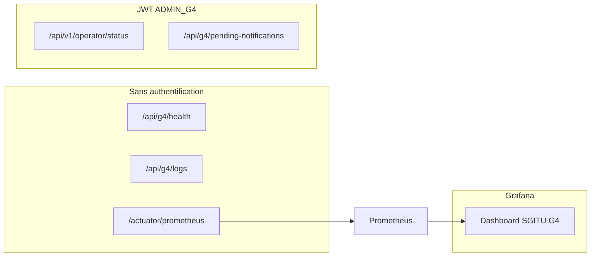

# Observabilité G4 — Pilier 2

## Triple couche de supervision



## 1. Health métier — `GET /api/g4/health`

Réponse exemple :

```json
{
  "status": "UP",
  "checkedAt": "2026-05-20T12:00:00Z",
  "components": {
    "database": "UP",
    "kafka": "ENABLED",
    "pendingNotifications": "0",
    "missionsEnCours": "2"
  },
  "buildVersion": "0.0.1-SNAPSHOT"
}
```

## 2. Logs structurés — `GET /api/g4/logs`

Buffer circulaire + persistance audit. Format console :

```
2026-05-20T12:00:00.123+01:00 [http-nio-8084-exec-1] INFO group=G4 service=g4-coordination ...
```

## 3. Actuator + Prometheus

| Endpoint | Description |
|----------|-------------|
| `/actuator/health` | Santé Spring (DB, diskSpace…) |
| `/actuator/prometheus` | Métriques scrape Prometheus |
| `/actuator/metrics` | Liste métriques Micrometer |

Métriques clés :
- `up{job="g4-coordination"}` — service vivant
- `http_server_requests_seconds_*` — latence / volume
- `resilience4j_circuitbreaker_state{name="g5Notification"}` — état circuit G5

## 4. Grafana

Démarrage (stack full) :

```bash
docker compose --profile monitoring up -d prometheus grafana
```

- Prometheus : http://localhost:9090/targets → target `g4-coordination:8084` **UP**
- Grafana : http://localhost:3000 → Dashboard **SGITU G4 — Coordination Transport**

Fichiers : `monitoring/prometheus.yml`, `monitoring/grafana/`

## Captures obligatoires (rapport)

| # | Capture | Fichier suggéré |
|---|---------|-----------------|
| 1 | Health JSON | `rapport/captures/01_health.png` |
| 2 | Logs supervision | `rapport/captures/02_logs.png` |
| 3 | Prometheus targets UP | `rapport/captures/03_prometheus.png` |
| 4 | Grafana dashboard | `rapport/captures/04_grafana.png` |
