# Diagrammes Mermaid — G4 Coordination des Transports

> Copier chaque bloc dans [Mermaid Live Editor](https://mermaid.live) pour exporter PNG/SVG pour le rapport LaTeX.

---

## 2.2 — Diagramme de cas d'utilisation

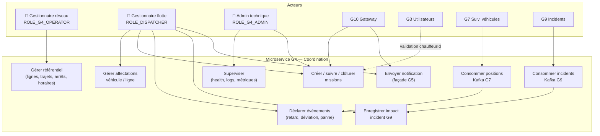

---

## 2.3 — Diagramme de classes — Domaine métier G4

### 2.3.1 Référentiel réseau

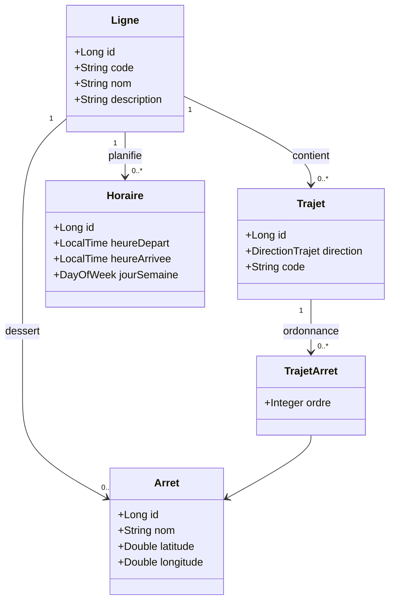

### 2.3.2 Exploitation flotte

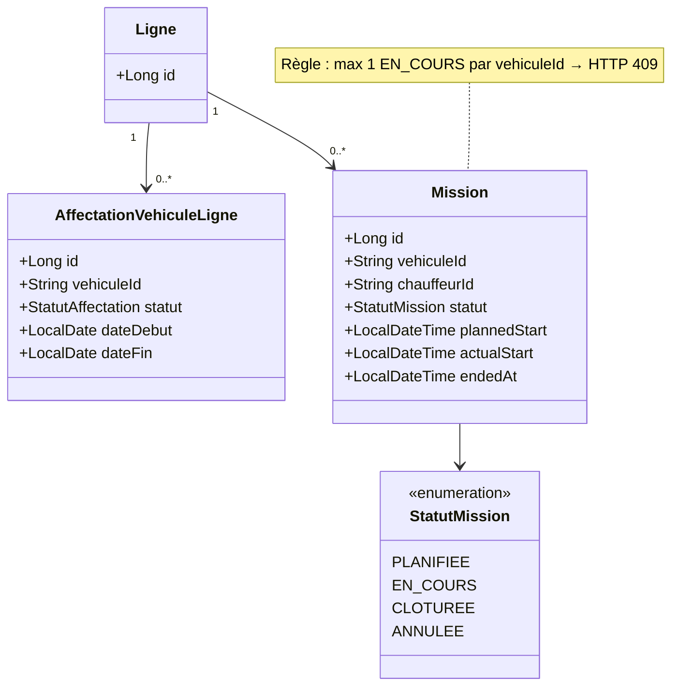

### 2.3.3 Coordination et incidents

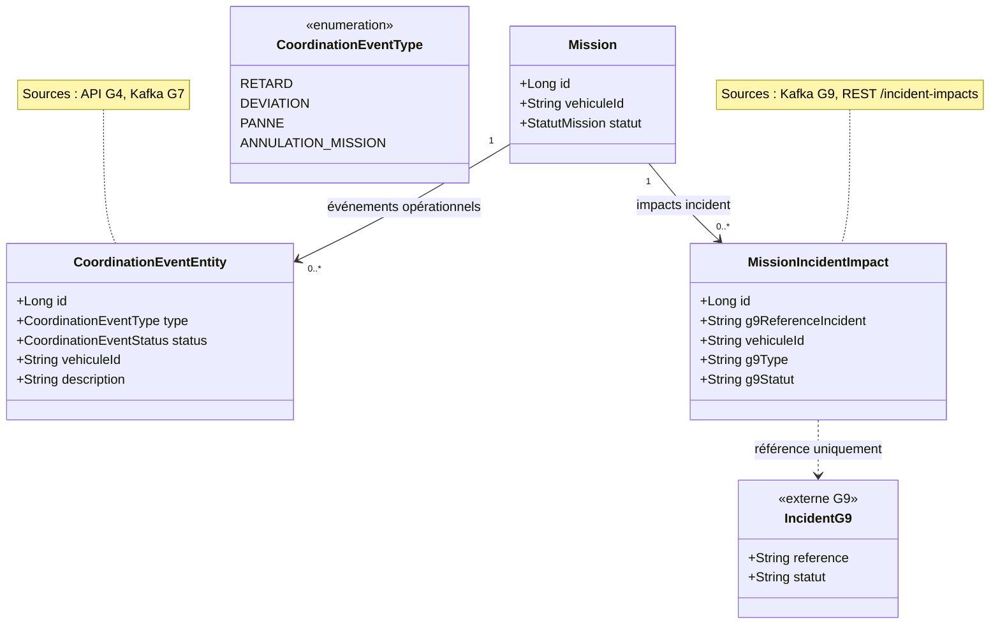

### 2.3.4 Résilience

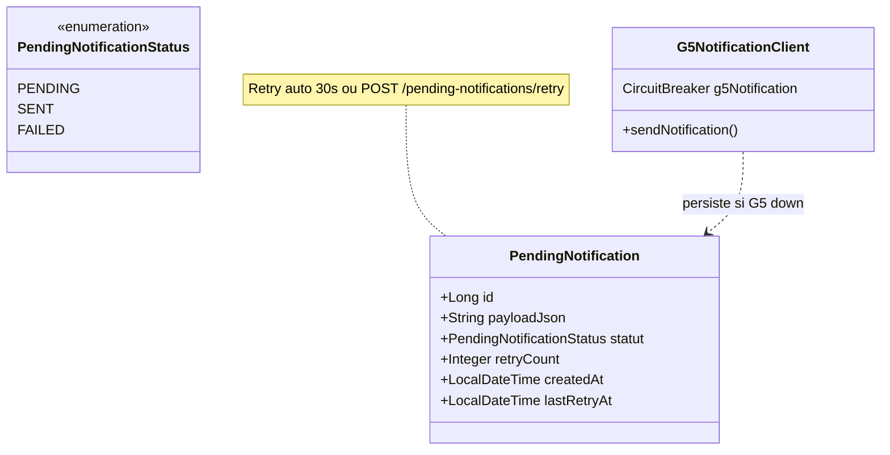

### 2.3 — Vue globale (toutes entités)

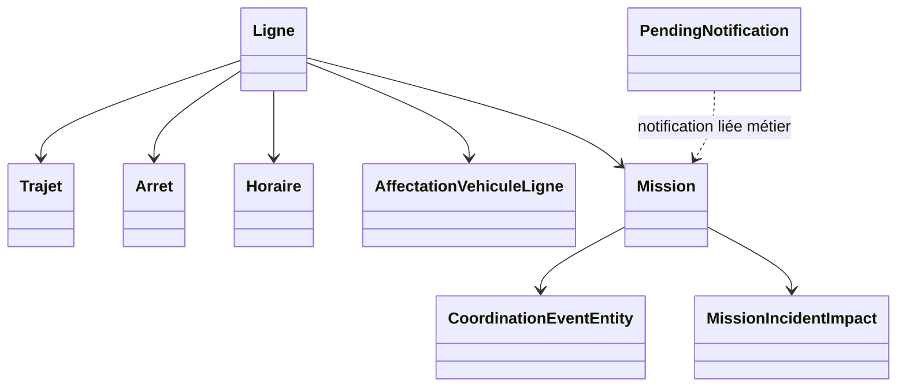

---

## 2.4 — Diagrammes de séquence

### 2.4.1 Séquence 1 — Création de mission (validation G3)

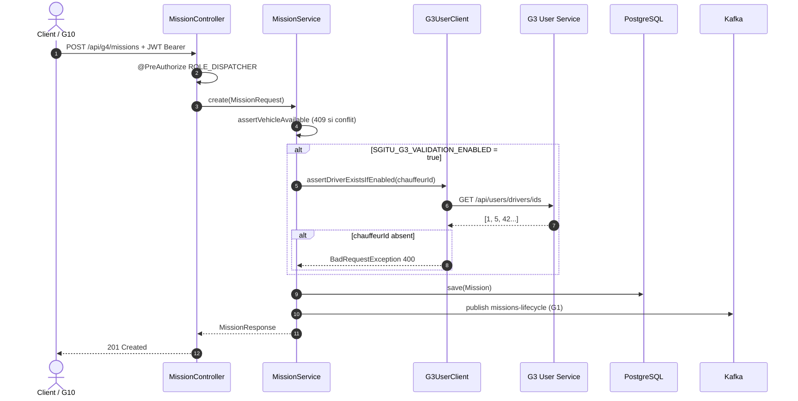

### 2.4.2 Séquence 2 — Consommation position G7 (Kafka)

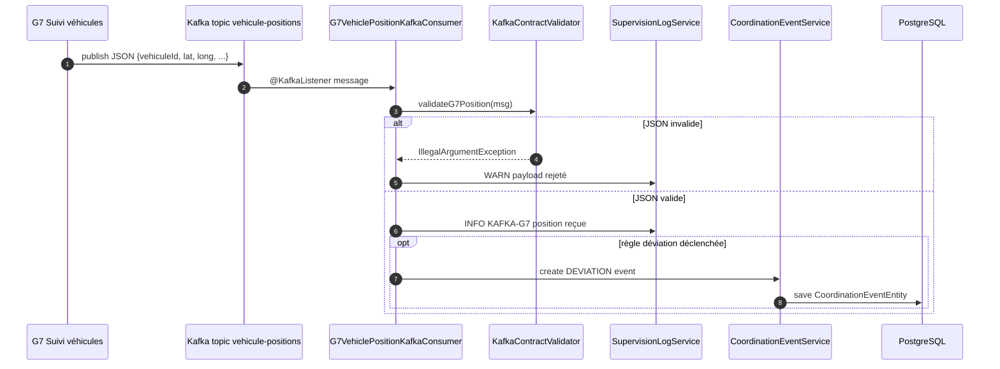

### 2.4.3 Séquence 3 — Notification Chaos Monkey (G5 down)

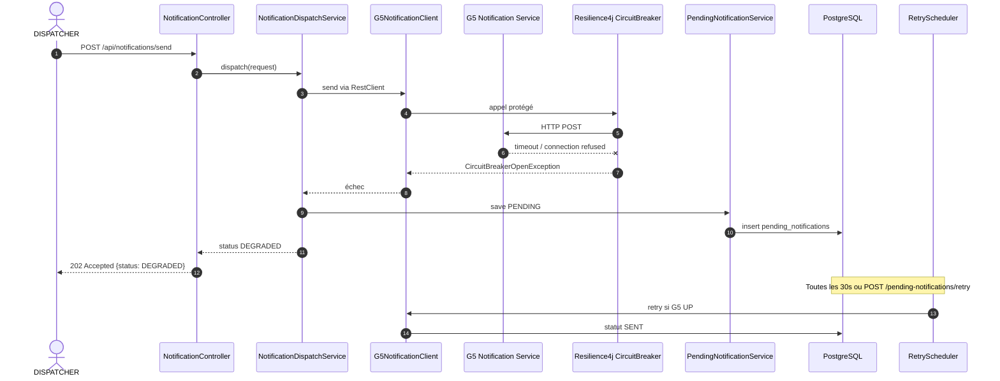

### 2.4.4 Séquence 4 — Impact incident G9

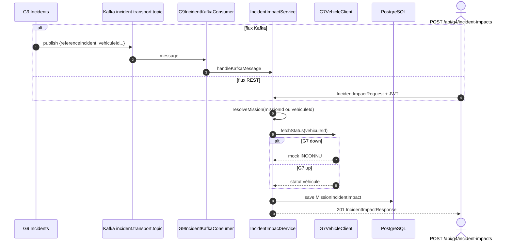

---

## 2.5 — Diagramme de composants

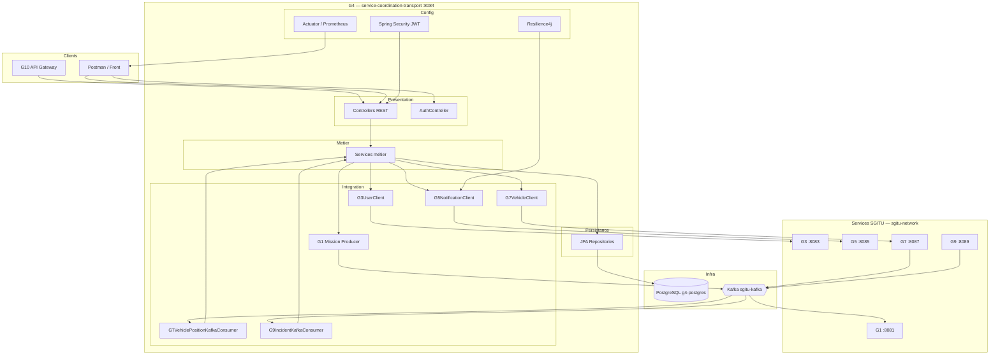

---

## 2.6 — Diagramme de déploiement

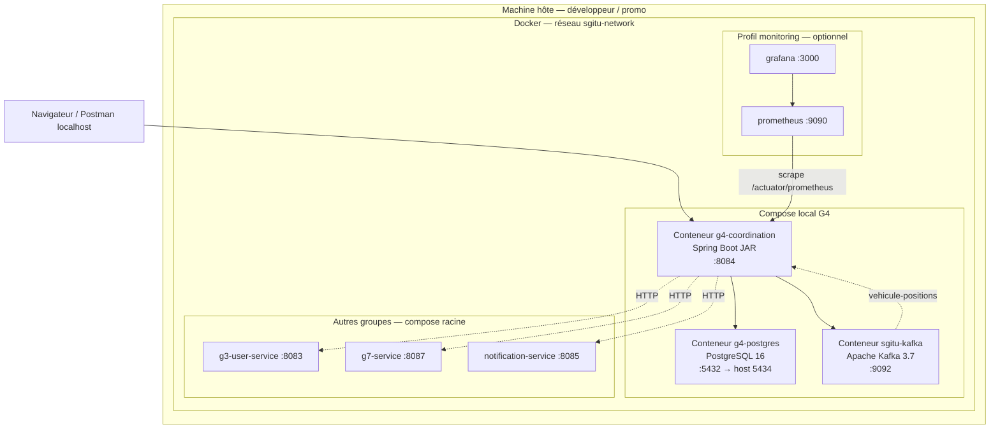

---

## 2.7 — Diagramme d'activité — Détection déviation (G7)

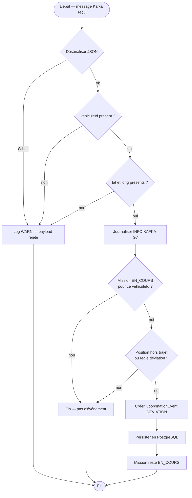

---

## 2.8 — Diagramme de packages (structure code)

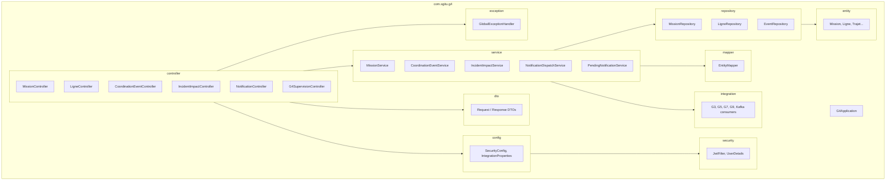

---

## Export pour le rapport LaTeX

1. Ouvrir https://mermaid.live
2. Coller un diagramme
3. **Actions → PNG/SVG** → enregistrer dans `figures/` avec le nom du rapport :
   - `uml_use_case_g4.png`
   - `uml_classes_domaine_g4.png`
   - `uml_seq_mission_create.png`
   - etc.
